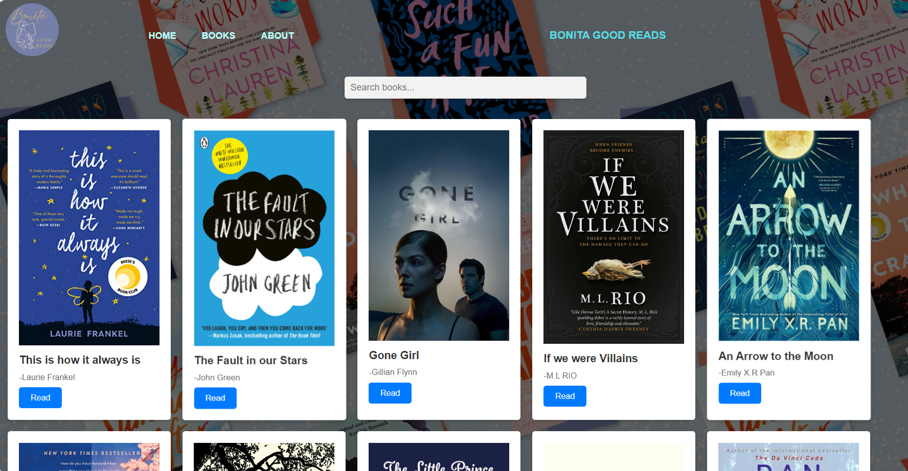

# BookReviewWebsite

This is a project created for our User Interface Design class. It focuses on the visual layout and design of a book catalog website. While the site isn't fully functional and doesn't support dynamic interactions, it showcases key design principles such as layout, navigation, and responsiveness.

## Design Focus
- **User Interface Design**: The project showcases a clean and simple interface with attention to user experience (UX) design principles.
- **Navigation Bar**: Clear and structured navigation to explore different sections of the site
- **Book Catalog**: Displays a selection of books with placeholders for images and reviews.
- **Typography**: Aimed to create an easy-to-read layout with appropriate font choices.
- **Color Scheme**: Designed with a neutral color palette for a minimalist look.
- **Card Layout**: Books are presented as "cards" that include the title, author, and description.
- **Search Functionality**: Placeholder search bar is added for a more complete design experience

## The Interface
  
  
  
